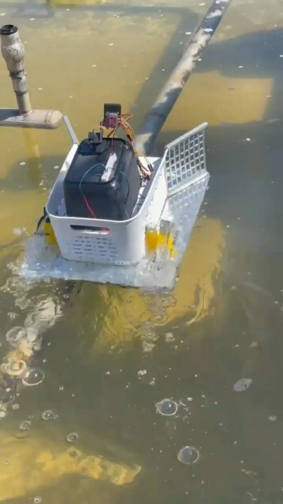
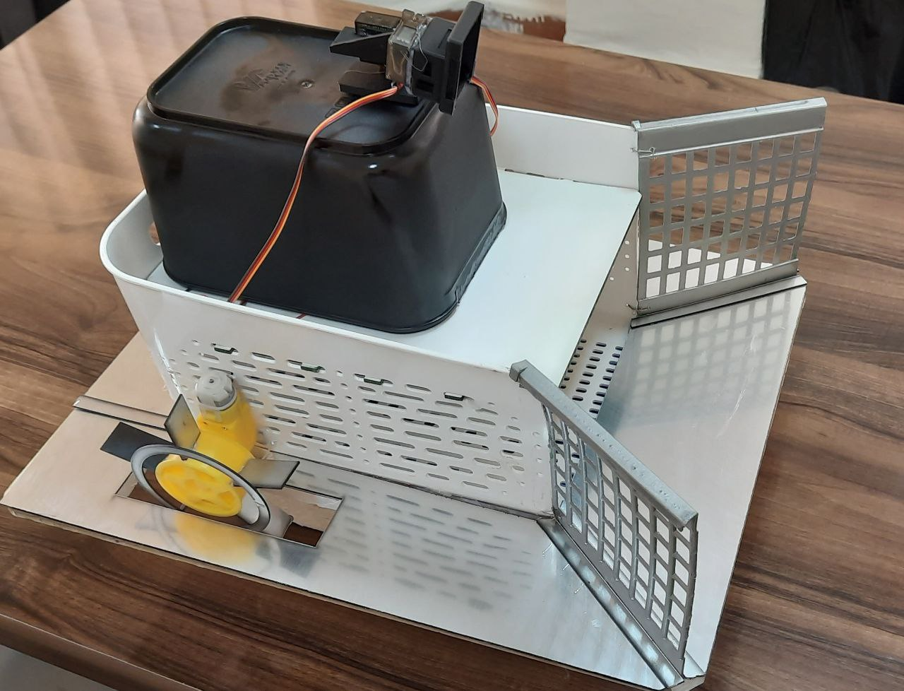
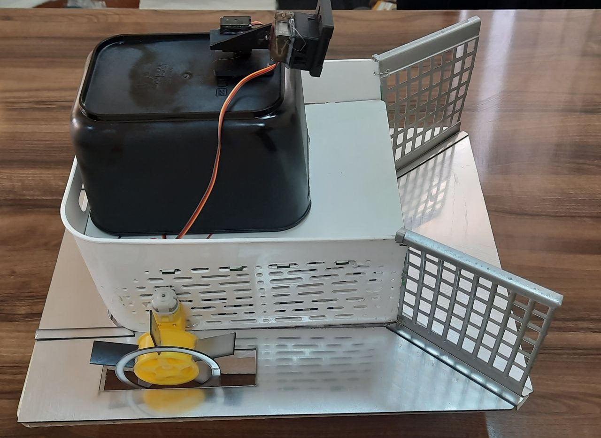
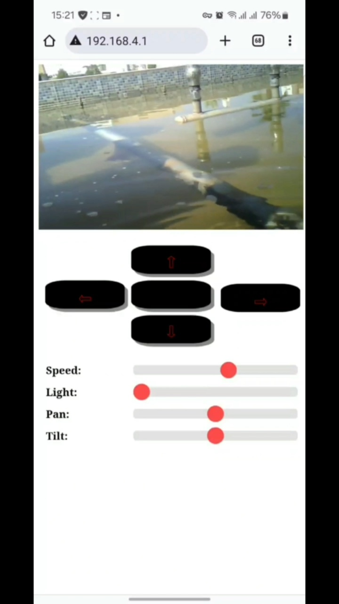
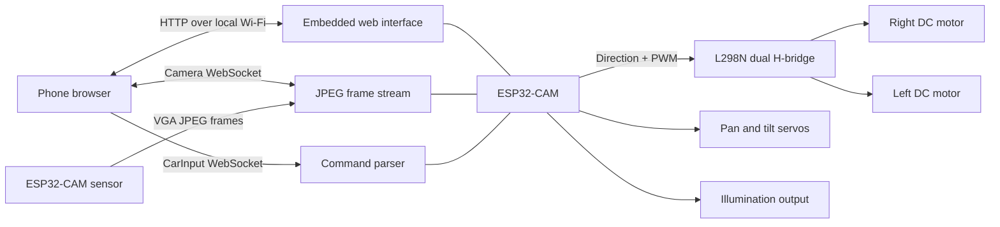
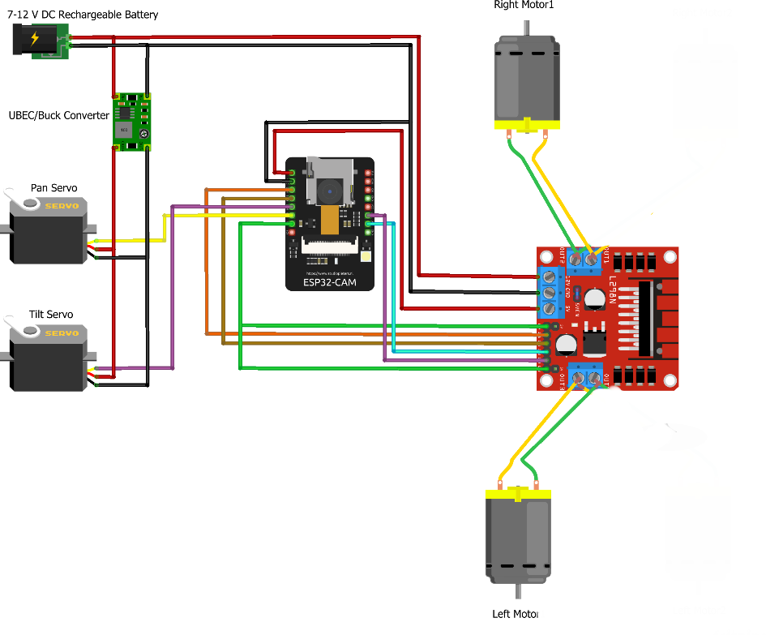

# Remote-Controlled Water Surface Cleaning Boat

An ESP32-CAM surface-cleaning boat prototype with browser-based live video and remote differential propulsion control.

> **Control mode:** remotely controlled. The current firmware does not implement autonomous navigation, obstacle avoidance, route planning, or waste detection.



## Overview

This project explores a small surface vessel for collecting floating waste while keeping the operator away from the water. The prototype combines a passive front collection area, twin side-mounted propulsion units, an ESP32-CAM, and a mobile-friendly browser interface.

The ESP32-CAM creates its own Wi-Fi access point. A connected phone opens the embedded web page to view the live camera feed and send motion, speed, light, camera-pan, and camera-tilt commands.

## Problem

Floating litter can accumulate along the edges of ponds, basins, and other calm water surfaces. Manual retrieval is repetitive and can expose operators to contaminated water or difficult access conditions. This prototype investigates remote inspection and collection from a compact floating platform.

## Solution

The implemented boat uses two independently reversible DC propulsion motors for forward, reverse, and differential steering. Two flared mesh guides at the front direct surface material toward the open collection area as the operator drives the boat. The firmware contains no separate conveyor or cleaning-actuator control.

The onboard ESP32-CAM handles the camera, web server, WebSocket connections, motor commands, PWM speed and light control, and two camera-positioning servos.

## Key Features

- ESP32-CAM JPEG video streamed to a browser over WebSocket
- Embedded mobile web interface; no separate phone application is required
- Forward, reverse, left, right, and stop controls
- Shared PWM speed control for the two propulsion motors
- Differential steering through independent motor direction control
- Camera pan and tilt through two servos
- Adjustable illumination output
- Self-hosted Wi-Fi access point for local operation
- Passive front guide-and-collection structure
- Documented in-water propulsion and browser-streaming test

## Prototype Gallery

| Prototype overview | Front collection area |
| --- | --- |
|  |  |

| Water test | Browser control interface |
| --- | --- |
|  |  |

## System Architecture



### Data and control flow

1. The ESP32-CAM starts a local Wi-Fi access point and HTTP server.
2. The browser downloads the interface from the boat.
3. Captured JPEG frames are sent as binary messages on the `/Camera` WebSocket.
4. Browser controls send comma-separated key/value messages on `/CarInput`.
5. The firmware translates those messages into motor direction, PWM, light, pan, or tilt outputs.
6. A control disconnect stops the motors, switches off the light, and centers both servos.

## Hardware

The project files verify the following components:

- ESP32-CAM module; the exact commercial board variant is not documented
- Integrated camera using the ESP32 camera driver
- L298N dual H-bridge motor driver
- Two DC geared propulsion motors
- Side-mounted paddle-wheel propulsion hardware visible on the prototype
- Two servos for camera pan and tilt
- Controllable illumination output on GPIO 4
- Passive flared mesh guides and an open collection area
- Rechargeable 7–12 V supply and UBEC/buck converter in the project wiring diagram; battery chemistry, capacity, and exact converter model are not documented

No GPS, IMU, ultrasonic sensor, LiDAR, water-quality sensor, or other navigation/obstacle sensor is present in the supplied firmware or wiring diagram.



## Software

The firmware is a single Arduino/C++ sketch with embedded HTML, CSS, and JavaScript.

Dependencies:

- Espressif ESP32 Arduino core
- `esp_camera`
- `WiFi`
- `AsyncTCP`
- `ESPAsyncWebServer`
- `ESP32Servo`

The first two libraries are normally supplied by the ESP32 Arduino core. The remaining external libraries must be installed in the Arduino environment.

## Cleaning Mechanism

The physical prototype uses two angled mesh side guides around an open front deck. Their geometry is intended to funnel floating material inward while the boat advances. The supplied code controls only propulsion, camera positioning, lighting, and streaming; it does not drive a conveyor, rake, pump, or other active collection mechanism.

The available demonstration verifies movement and remote monitoring, but it does not visibly verify a debris pickup cycle or document collection capacity.

## Propulsion and Steering

Two DC geared motors drive the side propulsion units through an L298N driver. Both motors forward moves the boat ahead, both reverse moves it backward, and opposite directions produce left or right pivot turns. One PWM channel is connected to both motor-enable entries in the supplied sketch, so the interface sets a shared propulsion speed.

## ESP32-CAM Video Streaming

The camera is configured for JPEG output at VGA resolution with a single frame buffer. When a browser connects to `/Camera`, the main loop captures frames and sends each JPEG buffer as a binary WebSocket message. The browser converts incoming blobs into the image displayed above the controls.

The firmware performs streaming only. It contains no computer-vision or machine-learning model, image classification, object detection, or autonomous decision logic.

## Web Interface

The interface is stored in program memory inside the Arduino sketch and served at `/`. It provides:

- a live camera panel;
- touch controls for forward, reverse, left, right, and stop;
- sliders for propulsion speed and light intensity; and
- sliders for camera pan and tilt.

Communication stays on the ESP32-CAM access point. No cloud service, external API, or internet connection is used by the supplied code.

## Repository Structure

```text
.
├── assets/images/                  # Selected prototype and demo images
├── docs/PROJECT_AUDIT.md           # Evidence-based project audit
├── firmware/boat_controller/
│   ├── boat_controller.ino         # ESP32-CAM firmware and embedded web UI
│   └── secrets.example.h           # Safe configuration template
├── hardware/diagrams/
│   └── wiring-diagram.png          # Recovered project wiring diagram
├── .gitattributes
├── .gitignore
└── README.md
```

The original poster and raw demonstration video remain local-only and are intentionally ignored by Git.

## Installation and Setup

1. Install the Arduino IDE or another compatible ESP32 Arduino build environment.
2. Install an Espressif ESP32 Arduino core version compatible with the sketch's `ledcSetup` and `ledcAttachPin` APIs.
3. Install `AsyncTCP`, `ESPAsyncWebServer`, and `ESP32Servo`.
4. Copy the configuration template:

   ```bash
   cp firmware/boat_controller/secrets.example.h firmware/boat_controller/secrets.h
   ```

5. Edit `secrets.h` and set a unique access-point name and a strong password of at least eight characters.
6. Open `firmware/boat_controller/boat_controller.ino`.
7. Select the ESP32-CAM board profile and upload settings that match the actual module. The exact board variant and flash settings are not recorded in the supplied files.
8. Verify the wiring against `hardware/diagrams/wiring-diagram.png` before applying power.
9. Compile and upload the sketch.

## Configuration

`secrets.h` is excluded from Git. It must define:

```cpp
constexpr char WIFI_AP_SSID[] = "YOUR_BOAT_AP_NAME";
constexpr char WIFI_AP_PASSWORD[] = "YOUR_STRONG_AP_PASSWORD";
```

Do not commit the real access-point password.

## Usage

1. Power the boat while it is safely supported and keep the propulsion area clear.
2. Connect a phone or computer to the configured Wi-Fi access point.
3. Open the access-point address in a browser. The demonstration used `192.168.4.1`; the firmware also obtains the address through `WiFi.softAPIP()`.
4. Confirm the camera feed and pan/tilt motion before placing the prototype in water.
5. Use short, low-speed inputs during the first water test and keep a safe retrieval method available.

The web server is local and unauthenticated beyond the Wi-Fi password. Operate only on a trusted, isolated connection.

## Demo

The supplied 58-second video documents:

- the prototype moving on water with its side propulsion units;
- the mobile browser connected to the boat's access-point address;
- live ESP32-CAM video; and
- the directional, speed, light, pan, and tilt controls.

The raw video is kept outside normal Git history because it is a large source-media artifact. The gallery includes representative frames from that recording.

## Current Limitations

- Remote control only; no autonomous control loop is implemented
- No obstacle detection or avoidance
- No positioning, mapping, waypoint, or route-planning capability
- No onboard waste detection, computer vision, or AI inference
- No dedicated active cleaning actuator in the firmware
- Debris collection performance and capacity are not documented
- Runtime, radio range, payload, speed, and endurance are not measured in the supplied files
- Waterproofing, buoyancy margin, electrical protection, and long-duration reliability are not documented
- Local access-point operation only, with no application-layer authentication or encryption
- Exact ESP32-CAM variant, battery specification, and motor model are not recorded

## Future Improvements

The following are development opportunities, not current features:

- add validated obstacle sensing and a fail-safe stop;
- add localization and waypoint navigation before describing the platform as autonomous;
- instrument battery voltage, current, and remaining capacity;
- measure payload, collection capacity, range, runtime, and turning performance;
- improve waterproofing, cable strain relief, and electronics enclosure protection;
- add authenticated control messages and command timeouts;
- document the exact bill of materials, pin map, and assembly procedure; and
- validate the passive collection geometry with repeatable debris-recovery tests.

## Project Status

**Functional prototype — remote propulsion and live browser video demonstrated in water.**

## Author

Imad Eddine Djerarda

- [Portfolio](https://imadjr.github.io/portfolio/)
- [GitHub](https://github.com/Imadjr)
